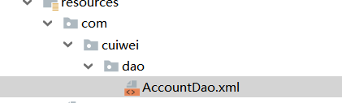

# **SSM**整合

## ***课程任务目标***

实现SSM整合

# **1.1** **需求和步骤分析**

**需求**

使用ssm框架完成对 account 表的增删改查操作。

***步骤分析***

```
1.准备数据库和表记录

2.创建web项目

3.编写mybatis在ssm环境中可以单独使用

4.编写spring在ssm环境中可以单独使用

5.spring整合mybatis

6.编写springMVC在ssm环境中可以单独使用

7.spring整合springMVC
```

# **1.2** **环境搭建**

## **1）** **准备数据库和表记录**

```mysql
CREATE TABLE `account` (
`id` int(11) NOT NULL AUTO_INCREMENT,
`name` varchar(32) DEFAULT NULL,
`money` double DEFAULT NULL, PRIMARY KEY (`id`)
) ENGINE=InnoDB AUTO_INCREMENT=3 DEFAULT CHARSET=utf8;

insert	into `account`(`id`,`name`,`money`) values (1,'tom',1000), (2,'jerry',1000);
```

## **2）** **创建**web****项目


# **1.3** **编写**mybatis****在****ssm****环境中可以单独使用

需求基于mybatis先来实现对account表的查询

## **1）** **相关坐标**

 

```xml
<!--mybatis坐标-->
<dependency>
    <groupId>mysql</groupId>
    <artifactId>mysql-connector-java</artifactId>
    <version>5.1.47</version>
</dependency>
<dependency>
    <groupId>com.alibaba</groupId>
    <artifactId>druid</artifactId>
    <version>1.1.15</version>
</dependency>
<dependency>
    <groupId>org.mybatis</groupId>
    <artifactId>mybatis</artifactId>
    <version>3.5.1</version>
</dependency>
<dependency>
    <groupId>junit</groupId>
    <artifactId>junit</artifactId>
    <version>4.12</version>
</dependency>
</dependencies>
```

## **2）** **Account**实体

```java
public class Account {

    private  Integer id;
    private String name;
    private  Double money;

    public Integer getId() {
        return id;
    }

    public void setId(Integer id) {
        this.id = id;
    }

    public String getName() {
        return name;
    }

    public void setName(String name) {
        this.name = name;
    }

    public Double getMoney() {
        return money;
    }

    public void setMoney(Double money) {
        this.money = money;
    }

    @Override
    public String toString() {
        return "Account{" +
                "id=" + id +
                ", name='" + name + '\'' +
                ", money=" + money +
                '}';
    }
}
```

## **3）** **AccountDao**接口

```java
public interface AccountDao  {

    /**
     * 查询所有用户
     *
     */

    public List<Account> findAll();
}
```

 

## **4）** **AccountDao.xml**映射

```xml
<?xml version="1.0" encoding="UTF-8" ?>
<!DOCTYPE mapper PUBLIC "-//mybatis.org//DTD Mapper 3.0//EN" "http://mybatis.org/dtd/mybatis-3-mapper.dtd">
<mapper namespace="com.cuiwei.dao.AccountDao">
    <!--查询所有账户-->
    <select id="findAll" resultType="com.cuiwei.domain.Account">
        select * from account
    </select>
</mapper>
```

## **5）** **mybatis**核心配置文件

jdbc.properties

```xml
jdbc.driver=com.mysql.jdbc.Driver
jdbc.url=jdbc:mysql:///spring_db
jdbc.username=root
jdbc.password=123456
```

SqlMapConfig.xml

```xml
<?xml version="1.0" encoding="UTF-8" ?>
<!DOCTYPE configuration PUBLIC "-//mybatis.org//DTD Config 3.0//EN"
        "http://mybatis.org/dtd/mybatis-3-config.dtd">

<configuration>

<!--加载properties文件-->
    <properties resource="jdbc.properties"></properties>


    <!--类型别名配置-->
    <typeAliases>
        <package name="com.cuiwei.domain"/>
    </typeAliases>


    <!--数据源-->
    <environments default="dev">
        <environment id="dev">
            <transactionManager type="JDBC"></transactionManager>
            <dataSource type="POOLED">
                <property name="driver" value="${jdbc.driver}"/>
                <property name="url" value="${jdbc.url}"/>
                <property name="username" value="${jdbc.username}"/>
                <property name="password" value="${jdbc.password}"/>
            </dataSource>
        </environment>
    </environments>


    <!--加载映射-->
    <mappers>
        <package name="com.cuiwei.dao"/>
    </mappers>

</configuration>
```

## **6）** **测试代码**

```java
public class MyBatisTest {

    @Test
    public void testMybatis() throws IOException {

        //记载核心配置文件
        InputStream resourceAsStream = Resources.getResourceAsStream("SqlMapConfig.xml");

        //创建SqlSession工厂对象
        SqlSessionFactory sqlSessionFactory = new SqlSessionFactoryBuilder().build(resourceAsStream);

        //获取SqlSession会话对象
        SqlSession sqlSession = sqlSessionFactory.openSession();

        //获取Mapper代理对象
        AccountDao mapper = sqlSession.getMapper(AccountDao.class);

        //执行
        List<Account> all = mapper.findAll();

        for (Account account : all) {
            System.out.println(account);
        }

        //释放资源
        sqlSession.close();

    }
}
```

注意：在测试时候，出现了Invalid bound statement (not found): com.cuiwei.dao.AccountDao.findAll  的错误，这里是因为AccountDao加载失败，解决方法就是：




保持一致。

# **1.4** **编写**spring在ssm环境中可以单独使用

## **1）** **相关坐标**

```xml
    <!--spring坐标-->
        <dependency>
            <groupId>org.springframework</groupId>
            <artifactId>spring-context</artifactId>
            <version>5.1.5.RELEASE</version>
        </dependency>
        <dependency>
            <groupId>org.aspectj</groupId>
            <artifactId>aspectjweaver</artifactId>
            <version>1.8.13</version>
        </dependency>
        <dependency>
            <groupId>org.springframework</groupId>
            <artifactId>spring-jdbc</artifactId>
            <version>5.1.5.RELEASE</version>
        </dependency>
        <dependency>
            <groupId>org.springframework</groupId>
            <artifactId>spring-tx</artifactId>
            <version>5.1.5.RELEASE</version>
        </dependency>
        <dependency>
        <groupId>org.springframework</groupId>
            <artifactId>spring-test</artifactId>
            <version>5.1.5.RELEASE</version>
        </dependency>
```

## **2）** **AccountService**接口

```java
public interface AccountService {

    public List<Account> findAll();
}
```

## **3）** **AccountServiceImpl**实现


```java
@Service
public class AccountServiceImpl implements AccountService {

    /**
     * 测试Spring在SSM环境中的单独使用
     * @return
     */
    public List<Account> findAll() {
        System.out.println("findAll执行了") ;
    return null;
    }
}
```

 

## **4）** **spring**核心配置文件

applicationContext.xml

```java
<?xml version="1.0" encoding="UTF-8"?>
<beans xmlns="http://www.springframework.org/schema/beans" xmlns:xsi="http://www.w3.org/2001/XMLSchema-instance" xmlns:context="http://www.springframework.org/schema/context" xmlns:tx="http://www.springframework.org/schema/tx" xmlns:aop="http://www.springframework.org/schema/aop" xsi:schemaLocation="
http://www.springframework.org/schema/beans http://www.springframework.org/schema/beans/spring-beans.xsd
http://www.springframework.org/schema/context http://www.springframework.org/schema/context/spring-context.xsd
http://www.springframework.org/schema/tx http://www.springframework.org/schema/tx/spring-tx.xsd
http://www.springframework.org/schema/aop http://www.springframework.org/schema/aop/spring-aop.xsd">


    <!--配置IOC相关操作：开启注解扫描-->
    <context:component-scan base-package="com.cuiwei.service"></context:component-scan>


</beans>
```


## **5）** **测试代码**

 

```java
@RunWith(SpringJUnit4ClassRunner.class)
@ContextConfiguration("classpath:ApplicationContext.xml")
public class SpringTest {

    @Autowired
    private AccountService accountService;

    @Test
    public void testSpring(){
        accountService.findAll();
    }

}
```

**这里的两个注解 @RunWith是为了让让其测试环境在Spring环境下进行，@ConrtextConfigration是为了加载核心配置文件，且必须有classpath.**

# **1.5** **spring**整合mybatis

## **1）** **整合思想**

将mybatis接口代理对象的创建权交给spring管理，我们就可以把dao的代理对象注入到service中，  此时也就完成了spring与mybatis的整合了。

## **2）** **导入整合包**

```xml
<!--mybatis整合spring坐标-->
<dependency>
    <groupId>org.mybatis</groupId>
    <artifactId>mybatis-spring</artifactId>
    <version>1.3.1</version>
</dependency>
```

## **3）** **spring**配置文件管理****mybatis

注意：此时可以将mybatis主配置文件删除。

```xml
<?xml version="1.0" encoding="UTF-8"?>
<beans xmlns="http://www.springframework.org/schema/beans" xmlns:xsi="http://www.w3.org/2001/XMLSchema-instance"
       xmlns:context="http://www.springframework.org/schema/context" xmlns:tx="http://www.springframework.org/schema/tx"
       xmlns:aop="http://www.springframework.org/schema/aop" xmlns:util="http://www.springframework.org/schema/util"
       xsi:schemaLocation="http://www.springframework.org/schema/beans http://www.springframework.org/schema/beans/spring-beans.xsd
http://www.springframework.org/schema/context http://www.springframework.org/schema/context/spring-context.xsd
http://www.springframework.org/schema/tx http://www.springframework.org/schema/tx/spring-tx.xsd
http://www.springframework.org/schema/aop http://www.springframework.org/schema/aop/spring-aop.xsd http://www.springframework.org/schema/util http://www.springframework.org/schema/util/spring-util.xsd">


    <!--配置IOC相关操作:开启注解扫描-->
    <context:component-scan base-package="com.cuiwei.service"></context:component-scan>

    <!--spring整合mybatis开始...................-->
    <context:property-placeholder location="classpath:jdbc.properties"></context:property-placeholder>

    <bean id="dataSource" class="com.alibaba.druid.pool.DruidDataSource">
        <property name="driverClassName" value="${jdbc.driver}"/>
        <property name="url" value="${jdbc.url}"/>
        <property name="username" value="${jdbc.username}"/>
        <property name="password" value="${jdbc.password}"/>
    </bean>

    <!--sqlSessionFactory的创建权交给了spring 生产sqlSession-->
    <bean id="sqlSessionFactory" class="org.mybatis.spring.SqlSessionFactoryBean">
        <property name="dataSource" ref="dataSource"></property>
        <property name="typeAliasesPackage" value="com.cuiwei.domain"></property>

        <!--引入加载mybatis的核心配置文件，可以不用去加载-->
        <!-- <property name="configLocation" value="classpath:SqlMapConfig.xml"></property>-->
    </bean>

    <!--mapper映射扫描 MapperScannerConfigurer扫描该包下所有接口，生成代理对象存到IOC容器中-->
    <bean class="org.mybatis.spring.mapper.MapperScannerConfigurer">
        <property name="basePackage" value="com.cuiwei.dao"></property>
    </bean>
    <!--spring整合mybatis结束..........-->

</beans>
```


## **4）** ***修改****AccountServiceImpl*

```java
    @Autowired
    private AccountDao accountDao;
    public List<Account> findAll() {
          return accountDao.findAll();
    }
}
```

## 5）修改测试类

```java
@RunWith(SpringJUnit4ClassRunner.class)
@ContextConfiguration("classpath:ApplicationContext.xml")
public class SpringTest {

    @Autowired
    private AccountService accountService;

    @Test
    public void testSpring(){
        List<Account> all = accountService.findAll();
        for (Account account : all) {
            System.out.println(account);
        }
    }

}
```

# **1.6** **编写**springMVC在ssm环境中可以单独使用

需求：访问到controller里面的方法查询所有账户，并跳转到list.jsp页面进行列表展示

## **1）** **相关坐标**

```xml
<!--springMVC坐标-->
<dependency>
    <groupId>org.springframework</groupId>
    <artifactId>spring-webmvc</artifactId>
    <version>5.1.5.RELEASE</version>
</dependency>
<dependency>
    <groupId>javax.servlet</groupId>
    <artifactId>javax.servlet-api</artifactId>
    <version>3.1.0</version>
    <scope>provided</scope>
</dependency>
<dependency>
    <groupId>javax.servlet.jsp</groupId>
    <artifactId>jsp-api</artifactId>
    <version>2.2</version>
    <scope>provided</scope>
</dependency>
<dependency>
    <groupId>jstl</groupId>
    <artifactId>jstl</artifactId>
    <version>1.2</version>
</dependency>
```

## **2）** **导入页面资源**


## **3）** **前端控制器**DispathcerServlet

```xml
<?xml version="1.0" encoding="UTF-8"?>
<web-app xmlns="http://xmlns.jcp.org/xml/ns/javaee"
         xmlns:xsi="http://www.w3.org/2001/XMLSchema-instance"
         xsi:schemaLocation="http://xmlns.jcp.org/xml/ns/javaee http://xmlns.jcp.org/xml/ns/javaee/web-app_4_0.xsd"
         version="4.0">
    <!--中文乱码过滤器   解决POST方式提交的乱码问题-->
    <filter>
        <filter-name>CharacterEncodingFilter</filter-name>
        <filter-class>org.springframework.web.filter.CharacterEncodingFilter</filter-class>
        <init-param>
            <param-name>encoding</param-name>
            <param-value>UTF-8</param-value>
        </init-param>
    </filter>
    <filter-mapping>
        <filter-name>CharacterEncodingFilter</filter-name>
        <url-pattern>/*</url-pattern>
    </filter-mapping>

    <!--前端控制器-->
    <servlet>
        <servlet-name>DispatcherServlet</servlet-name>
        <servlet-class>org.springframework.web.servlet.DispatcherServlet</servlet-class>
        <init-param>
            <param-name>contextConfigLocation</param-name>
            <param-value>classpath:spring-mvc.xml</param-value>
        </init-param>
        <load-on-startup>2</load-on-startup>
    </servlet>
    <servlet-mapping>
        <servlet-name>DispatcherServlet</servlet-name>
        <url-pattern>/</url-pattern>
    </servlet-mapping>
</web-app>
```

## **4）** **AccountControlle和 **list.jsp

```java
@Controller
@RequestMapping("/account")
public class AccountController {

    /**
     * 查询所有用户
     */

    @RequestMapping("/findAll")
    public String findAll(Model model){
        //查询所有用户
        ArrayList<Account> accounts = new ArrayList<Account>();
        Account account = new Account();
        account.setId(1);
        account.setName("崔巍");
        account.setMoney(1000d);

        Account account2 = new Account();
        account2.setId(2);
        account2.setName("大头");
        account2.setMoney(1500d);

        accounts.add(account);
        accounts.add(account2);

        model.addAttribute("list",accounts);

        return "list";

    }

}
```

## **5）** **springMVC**核心配置文件

```xml
<beans xmlns="http://www.springframework.org/schema/beans" xmlns:mvc="http://www.springframework.org/schema/mvc" xmlns:context="http://www.springframework.org/schema/context" xmlns:xsi="http://www.w3.org/2001/XMLSchema-instance" xsi:schemaLocation="http://www.springframework.org/schema/beans
http://www.springframework.org/schema/beans/spring-beans.xsd http://www.springframework.org/schema/mvc http://www.springframework.org/schema/mvc/spring-mvc.xsd http://www.springframework.org/schema/context http://www.springframework.org/schema/context/spring-context.xsd">

    <!--1.配置注解扫描   只扫描Controller-->
    <context:component-scan base-package="com.cuiwei.controller"></context:component-scan>

    <!--2.mvc注解增强，处理器映射器以及处理器适配器-->
    <mvc:annotation-driven></mvc:annotation-driven>

    <!--3.视图解析器-->
    <bean id="InternalResourceViewResolver" class="org.springframework.web.servlet.view.InternalResourceViewResolver">
        <property name="prefix" value="/"></property>
        <property name="suffix" value=".jsp"></property>
    </bean>

    <!--4. 放行静态资源   将所有静态资源放行-->
    <mvc:default-servlet-handler></mvc:default-servlet-handler>
</beans>
```

## 注意：这里在运行时报错了

-  Establishing SSL connection without server's identity verification is not recommended. According to MySQL 5.5.45+, 5.6.26+ and 5.7.6+ requirements SSL connection must be established by default if explicit option isn't set. For compliance with existi
- 意思就是：原因是在MySQL 5.5.45+、5.6.26+和5.7.6+等版本中，不建议在没有服务器身份验证的情况下建立SSL连接，简单的来说， 就是需要设置一下useSSL，你可以设置为false来禁用SSL，或者设置为true来使用SSL，报这个警告的原因主要是JDBC的版本与MySQL的版本不兼容，而MySQL在高版本需要指明是否进行SSL连接。
- 解决方法是：jdbc.url=jdbc:mysql:///spring_db改为jdbc.url=jdbc:mysql:///spring_db?useSSL=false

# **1.7** **spring**整合springMVC


## **1）** **整合思想**

spring和springMVC其实根本就不用整合，本来就是一家。但是我们需要做到spring和web容器整合，让web容器启动的时候自动加载spring配置文件web容   器销毁的时候spring的ioc容器也销毁。

## **2）** **spring**和****web****容器整合

**ContextLoaderListener**加载【掌握】

可以使用spring-web包中的ContextLoaderListener监听器，可以监听servletContext容器的创建和销毁，来同时创建或销毁IOC容器。

```java
<!--配置Spring的监听器-->
<listener>
    <listener-class>org.springframework.web.context.ContextLoaderListener</listener-class>
</listener>

<!--全局参数-->
<context-param>
    <param-name>contextConfigLocation</param-name>
    <param-value>classpath:ApplicationContext.xml</param-value>
</context-param>
```

## **3）** **修改**AccountController

```java
@Controller
@RequestMapping("/account")
public class AccountController {


    @Autowired
    private AccountService accountService;
    /*
        查询所有用户
     */

    @RequestMapping("/findAll")
    public  String findAll(Model model){

        //实现查询所有账户
        List<Account> list = accountService.findAll();

        // 把封装好的list存到model中
        model.addAttribute("list",list);

        return "list";
        
    }
}
```

##  监听器和过滤器的区别：

- Servlet中的过滤器Filter是实现了javax.servlet.Filter接口的服务器端程序，主要的用途是过滤字符编码、做一些业务逻辑判断等。其工作原理是，只要你在web.xml文件配置好要拦截的客户端请求，它都会帮你拦截到请求，此时你就可以对请求或响应(Request、Response)统一设置编码，简化操作；同时还可以进行逻辑判断，如用户是否已经登录、有没有权限访问该页面等等工作，它是随你的web应用启动而启动的，只初始化一次，以后就可以拦截相关的请求，只有当你的web应用停止或重新部署的时候才能销毁。
-  Servlet的监听器Listener，它是实现了javax.servlet.ServletContextListener接口的服务器端程序，它也是随web应用的启动而启动，只初始化一次，随web应用的停止而销毁。主要作用是：做一些初始化的内容添加工作、设置一些基本的内容、比如一些参数或者是一些固定的对象等等。


# **1.8** **spring**配置声明式事务

## **1）** **spring**配置文件加入声明式事务

```xml
<!--Spring声明式事务-->
<!--1.事务管理器-->
<bean id="transactionManager" class="org.springframework.jdbc.datasource.DataSourceTransactionManager">
    <property name="dataSource" ref="dataSource"></property>
</bean>

<!--2.开启事务注解的支持-->
<tx:annotation-driven></tx:annotation-driven>
```

## **2）** **add.jsp**

```jsp
<%@ page contentType="text/html;charset=UTF-8" language="java" %>
<!-- 网页使用的语言 -->
<html lang="zh-CN">
<head>
    <!-- 指定字符集 -->
    <meta charset="utf-8">
    <!-- 使用Edge最新的浏览器的渲染方式 -->
    <meta http-equiv="X-UA-Compatible" content="IE=edge">
    <!-- viewport视口：网页可以根据设置的宽度自动进行适配，在浏览器的内部虚拟一个容器，容器的宽度与设备的宽度相同。
    width: 默认宽度与设备的宽度相同
    initial-scale: 初始的缩放比，为1:1 -->
    <meta name="viewport" content="width=device-width, initial-scale=1">
    <!-- 上述3个meta标签*必须*放在最前面，任何其他内容都*必须*跟随其后！ -->
    <title>添加用户</title>

    <!-- 1. 导入CSS的全局样式 -->
    <link href="${pageContext.request.contextPath}/css/bootstrap.min.css" rel="stylesheet">
    <!-- 2. jQuery导入，建议使用1.9以上的版本 -->
    <script src="${pageContext.request.contextPath}/js/jquery-2.1.0.min.js"></script>
    <!-- 3. 导入bootstrap的js文件 -->
    <script src="${pageContext.request.contextPath}/js/bootstrap.min.js"></script>
</head>
<body>
<div class="container">
    <center><h3>添加账户</h3></center>
    <div class="row">
        <div class="col-lg-3"></div>
        <div class="col-lg-6">
            <form action="${pageContext.request.contextPath}/account/save" method="post">
                <div class="form-group">
                    <label for="name">姓名：</label>
                    <input type="text" class="form-control" id="name" name="name" placeholder="请输入姓名">
                </div>
                      <div class="form-group">
                    <label for="money">余额：</label>
                    <input type="text" class="form-control" id="money" name="money" placeholder="请输入余额">
                </div>

                <div class="form-group" style="text-align: center">
                    <input class="btn btn-primary" type="submit" value="提交" />
                    <input class="btn btn-default" type="reset" value="重置" />
                    <input class="btn btn-default" type="button" onclick="history.go(-1)" value="返回" />
                </div>
            </form>
        </div>
        <div class="col-lg-3"></div>
    </div>
</div>
</body>
</html>
```

## **3）** **AccountController**


```java
@RequestMapping("/save")
public String save(Account account){
    accountService.save(account);
    //跳转到findAll方法重新查询一次数据库的遍历展示
    return "redirect:/account/findAll";
}
```

"redirect:/account/findAll"实现页面的跳转，也就是在执行完添加操作后，在执行一下查询操作，从而实现数据库内容的页面展示的更新。

## **4）** **AccountService**接口和实现类


```java
public void save(Account account);
```

 

```java
/**
 * 账户添加
 * @param account
 */
@Override
public void save(Account account) {
    accountDao.save(account);
}
```

## **5）** **AccountDao**

```java
/**
 * 账户的添加
 */

public void save(Account account);
```

## **6）** **AccountDao.xml**映射

```java
<!--添加账户-->
<insert id="save" parameterType="account">
    insert into account(name,money) values(#{name},#{money})
</insert>
```

# **1.9** **修改操作**

## **1.9.1** **数据回显**

也就是指定了一个用户，如果对其进修修改，那么应该跳转到修改页面，但是其name和money应该不能是空的，而应该是你所指定用户的name和money.

**①** **AccountController**

```java
/**
 * 根据ID查询账户信息，完成账户信息的回显
 */

@RequestMapping("/findById")
public String findById(Integer id,Model model){
    Account account = accountService.findBiId(id);

    //存到Model中
    model.addAttribute("account",account);

    //视图跳转
    return "update";
}
```

**②** **AccountService**接口和实现类

```java
 public Account  findBiId(Integer id);
```

```java
@Override
public Account findBiId(Integer id) {
    Account byId = accountDao.findById(id);
    return byId;
}
```

**③** **AccountDao**接口和映射文件

```java
/**
 * 根据ID查询用户信息
 * @param id
 * @return
 */
public Account findById(Integer id);
```

 

```
<!--根据ID查询用户-->
<select id="findById" parameterType="int" resultType="account">
    select * from account where id = #{id}
</select>
```

**④** **update.jsp**

```jsp
<%@ page contentType="text/html;charset=UTF-8" language="java" %>
<!-- 网页使用的语言 -->
<html lang="zh-CN">
<head>
    <!-- 指定字符集 -->
    <meta charset="utf-8">
    <!-- 使用Edge最新的浏览器的渲染方式 -->
    <meta http-equiv="X-UA-Compatible" content="IE=edge">
    <!-- viewport视口：网页可以根据设置的宽度自动进行适配，在浏览器的内部虚拟一个容器，容器的宽度与设备的宽度相同。
    width: 默认宽度与设备的宽度相同
    initial-scale: 初始的缩放比，为1:1 -->
    <meta name="viewport" content="width=device-width, initial-scale=1">
    <!-- 上述3个meta标签*必须*放在最前面，任何其他内容都*必须*跟随其后！ -->
    <title>添加用户</title>

    <!-- 1. 导入CSS的全局样式 -->
    <link href="${pageContext.request.contextPath}/css/bootstrap.min.css" rel="stylesheet">
    <!-- 2. jQuery导入，建议使用1.9以上的版本 -->
    <script src="${pageContext.request.contextPath}/js/jquery-2.1.0.min.js"></script>
    <!-- 3. 导入bootstrap的js文件 -->
    <script src="${pageContext.request.contextPath}/js/bootstrap.min.js"></script>
</head>
<body>
<div class="container">
    <center><h3>更新账户</h3></center>
    <div class="row">
        <div class="col-lg-3"></div>
        <div class="col-lg-6">
            <form action="${pageContext.request.contextPath}/account/update" method="post">
                <input type="hidden" name="id" value="${account.id}">
                <div class="form-group">
                    <label for="name">姓名：</label>
                    <input type="text" class="form-control" id="name" name="name" value="${account.name}" placeholder="请输入姓名">
                </div>
                <div class="form-group">
                    <label for="money">余额：</label>
                    <input type="text" class="form-control" id="money" name="money"  value="${account.money}" placeholder="请输入余额">
                </div>

                <div class="form-group" style="text-align: center">
                    <input class="btn btn-primary" type="submit" value="提交" />
                    <input class="btn btn-default" type="reset" value="重置" />
                    <input class="btn btn-default" type="button" onclick="history.go(-1)" value="返回" />
                </div>
            </form>
        </div>
        <div class="col-lg-3"></div>
    </div>
</div>
</body>
</html>
```

## **1.9.2** **账户更新**

**①** **AccountController**

```java
/**
 * 更新账户
 */

@RequestMapping("/update")
public String update(Account account){

    accountService.update(account);

    return "redirect:/account/findAll";

}
```

**②** **AccountService**接口和实现类

```java
 public void update(Account account);
```

```java
@Override
public void update(Account account) {
      accountDao.update(account);

}
```

**③** **AccountDao**接口和映射文件

```java
/**
 * 更新用户
 */
public void update(Account account);
```

```xml
<!--更新账户-->
<update id="update" parameterType="account">
    update account set name = #{name},money = #{money} where id = #{id}
</update>
```

# **1.10** **批量删除**

## **1）** **list.jsp**

```jsp
<%@ page contentType="text/html;charset=UTF-8" language="java" %>
<%@ taglib prefix="c" uri="http://java.sun.com/jsp/jstl/core" %>
<!DOCTYPE html>
<!-- 网页使用的语言 -->
<html lang="zh-CN">
<head>
    <!-- 指定字符集 -->
    <meta charset="utf-8">
    <!-- 使用Edge最新的浏览器的渲染方式 -->
    <meta http-equiv="X-UA-Compatible" content="IE=edge">
    <!-- viewport视口：网页可以根据设置的宽度自动进行适配，在浏览器的内部虚拟一个容器，容器的宽度与设备的宽度相同。
    width: 默认宽度与设备的宽度相同
    initial-scale: 初始的缩放比，为1:1 -->
    <meta name="viewport" content="width=device-width, initial-scale=1">
    <!-- 上述3个meta标签*必须*放在最前面，任何其他内容都*必须*跟随其后！ -->
    <title>账户列表</title>

    <!-- 1. 导入CSS的全局样式 -->
    <link href="${pageContext.request.contextPath}/css/bootstrap.min.css" rel="stylesheet">
    <!-- 2. jQuery导入，建议使用1.9以上的版本 -->
    <script src="${pageContext.request.contextPath}/js/jquery-2.1.0.min.js"></script>
    <!-- 3. 导入bootstrap的js文件 -->
    <script src="${pageContext.request.contextPath}/js/bootstrap.min.js"></script>
    <style type="text/css">
        td, th {
            text-align: center;
        }
    </style>
</head>
<body>
<div class="container">
  <div class="row">
      <h3 style="text-align: center">账户信息列表</h3>
      <div class="col-lg-2"></div>
      <div class="col-lg-8">
          <form action="${pageContext.request.contextPath}/account/deleteBatch" method="post" id="deleteBatchForm">
          <table border="1" class="table table-bordered table-hover">
              <tr class="success">
                  <th>
                      <input type="checkbox" id="checkAll">
                      <%--实现全选全不选效果--%>
                      <script>
                          $('#checkAll').click(function () {
                                $('input[name="ids"]').prop('checked',$(this).prop('checked'));
                          })
                      </script>

                  </th>
                  <th>编号</th>
                  <th>姓名</th>
                  <th>余额</th>
                  <th>操作</th>
              </tr>

              <c:forEach items="${list}" var="account">

              <tr>
                  <td>
                      <input type="checkbox" name="ids" value="${account.id}">
                  </td>
                  <td>${account.id}</td>
                  <td>${account.name}</td>
                  <td>${account.money}</td>
                  <td><a class="btn btn-default btn-sm" href="${pageContext.request.contextPath}/account/findById?id=${account.id}">修改</a>&nbsp;<a class="btn btn-default btn-sm" href="">删除</a></td>
              </tr>
              </c:forEach>


              <tr>
                  <td colspan="9" align="center">
                      <a class="btn btn-primary" href="${pageContext.request.contextPath}/add.jsp">添加账户</a>
                      <input class="btn btn-primary" type="button" value="删除选中" id="deleteBatchBtn">
                  </td>
              </tr>
          </table>
          </form>
      </div>
      <div class="col-lg-2"></div>
  </div>
</div>
</body>

<script>
    /*给删除选中按钮绑定点击事件*/
    $('#deleteBatchBtn').click(function () {
            if(confirm('您确定要删除吗')){
                //判断选中的复选框的长度是否为0，如果是，则一条也没选中，大于0说明至少选中了一条
                if($('input[name=ids]:checked').length > 0){
                    /*提交表单*/
                    $('#deleteBatchForm').submit();
                }

            }else {
                alert('想啥呢，没事瞎操作啥')
            }


    })

</script>

</html>
```


## **2）** **AccountController**

```java
/**
 * 批量删除
 */

@RequestMapping("/deleteBatch")
public String deleteBatch(Integer[] ids){
    accountService.deleteBatch(ids);
    return"redirect:/account/findAll";
}
```

 

## **3）** **AccountService**接口和实现类

```java
    public void deleteBatch(Integer[] ids);
```

 

```java
@Override
public void deleteBatch(Integer[] ids) {
    accountDao.deleteBatch(ids);
}
```

## **4）** **AccountDao**接口和映射文件

```java
/**
 * 批量删除
 * @param ids
 */
public void deleteBatch(Integer[] ids);
```

```xml
<!--批量删除-->
<delete id="deleteBatch" parameterType="int">
    delete from account
    <where>
        <foreach collection="array" open="id in (" close=")" separator="," item="id">
            #{id}
        </foreach>
    </where>
</delete>
```


 