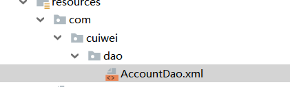

# **SSM**整合

## ***课程任务目标***

实现SSM整合

# **1.1** **需求和步骤分析**

**需求**

使用ssm框架完成对 account 表的增删改查操作。

***步骤分析***

```
1.准备数据库和表记录

2.创建web项目

3.编写mybatis在ssm环境中可以单独使用

4.编写spring在ssm环境中可以单独使用

5.spring整合mybatis

6.编写springMVC在ssm环境中可以单独使用

7.spring整合springMVC
```

# **1.2** **环境搭建**

**1）** **准备数据库和表记录**

```
CREATE TABLE `account` (
`id` int(11) NOT NULL AUTO_INCREMENT,
`name` varchar(32) DEFAULT NULL,
`money` double DEFAULT NULL, PRIMARY KEY (`id`)
) ENGINE=InnoDB AUTO_INCREMENT=3 DEFAULT CHARSET=utf8;

insert	into `account`(`id`,`name`,`money`) values (1,'tom',1000), (2,'jerry',1000);
```

**2）** **创建**web****项目


# **1.3** **编写**mybatis****在****ssm****环境中可以单独使用

需求基于mybatis先来实现对account表的查询

**1）** **相关坐标**

 

```
<!--mybatis坐标-->
<dependency>
    <groupId>mysql</groupId>
    <artifactId>mysql-connector-java</artifactId>
    <version>5.1.47</version>
</dependency>
<dependency>
    <groupId>com.alibaba</groupId>
    <artifactId>druid</artifactId>
    <version>1.1.15</version>
</dependency>
<dependency>
    <groupId>org.mybatis</groupId>
    <artifactId>mybatis</artifactId>
    <version>3.5.1</version>
</dependency>
<dependency>
    <groupId>junit</groupId>
    <artifactId>junit</artifactId>
    <version>4.12</version>
</dependency>
</dependencies>
```

**2）** **Account**实体

```
public class Account {

    private  Integer id;
    private String name;
    private  Double money;

    public Integer getId() {
        return id;
    }

    public void setId(Integer id) {
        this.id = id;
    }

    public String getName() {
        return name;
    }

    public void setName(String name) {
        this.name = name;
    }

    public Double getMoney() {
        return money;
    }

    public void setMoney(Double money) {
        this.money = money;
    }

    @Override
    public String toString() {
        return "Account{" +
                "id=" + id +
                ", name='" + name + '\'' +
                ", money=" + money +
                '}';
    }
}
```

**3）** **AccountDao**接口

```
public interface AccountDao  {

    /**
     * 查询所有用户
     *
     */

    public List<Account> findAll();
}
```

 

**4）** **AccountDao.xml**映射

```
<?xml version="1.0" encoding="UTF-8" ?>
<!DOCTYPE mapper PUBLIC "-//mybatis.org//DTD Mapper 3.0//EN" "http://mybatis.org/dtd/mybatis-3-mapper.dtd">
<mapper namespace="com.cuiwei.dao.AccountDao">
    <!--查询所有账户-->
    <select id="findAll" resultType="com.cuiwei.domain.Account">
        select * from account
    </select>
</mapper>
```

**5）** **mybatis**核心配置文件

jdbc.properties

```
jdbc.driver=com.mysql.jdbc.Driver
jdbc.url=jdbc:mysql:///spring_db
jdbc.username=root
jdbc.password=123456
```

SqlMapConfig.xml

```xml
<?xml version="1.0" encoding="UTF-8" ?>
<!DOCTYPE configuration PUBLIC "-//mybatis.org//DTD Config 3.0//EN"
        "http://mybatis.org/dtd/mybatis-3-config.dtd">

<configuration>

<!--加载properties文件-->
    <properties resource="jdbc.properties"></properties>


    <!--类型别名配置-->
    <typeAliases>
        <package name="com.cuiwei.domain"/>
    </typeAliases>


    <!--数据源-->
    <environments default="dev">
        <environment id="dev">
            <transactionManager type="JDBC"></transactionManager>
            <dataSource type="POOLED">
                <property name="driver" value="${jdbc.driver}"/>
                <property name="url" value="${jdbc.url}"/>
                <property name="username" value="${jdbc.username}"/>
                <property name="password" value="${jdbc.password}"/>
            </dataSource>
        </environment>
    </environments>


    <!--加载映射-->
    <mappers>
        <package name="com.cuiwei.dao"/>
    </mappers>

</configuration>
```

**6）** **测试代码**

```java
public class MyBatisTest {

    @Test
    public void testMybatis() throws IOException {

        //记载核心配置文件
        InputStream resourceAsStream = Resources.getResourceAsStream("SqlMapConfig.xml");

        //创建SqlSession工厂对象
        SqlSessionFactory sqlSessionFactory = new SqlSessionFactoryBuilder().build(resourceAsStream);

        //获取SqlSession会话对象
        SqlSession sqlSession = sqlSessionFactory.openSession();

        //获取Mapper代理对象
        AccountDao mapper = sqlSession.getMapper(AccountDao.class);

        //执行
        List<Account> all = mapper.findAll();

        for (Account account : all) {
            System.out.println(account);
        }

        //释放资源
        sqlSession.close();

    }
}
```

注意：在测试时候，出现了Invalid bound statement (not found): com.cuiwei.dao.AccountDao.findAll  的错误，这里是因为AccountDao加载失败，解决方法就是：




保持一致。

# **1.4** **编写**spring在ssm环境中可以单独使用

**1）** **相关坐标**

```xml
    <!--spring坐标-->
        <dependency>
            <groupId>org.springframework</groupId>
            <artifactId>spring-context</artifactId>
            <version>5.1.5.RELEASE</version>
        </dependency>
        <dependency>
            <groupId>org.aspectj</groupId>
            <artifactId>aspectjweaver</artifactId>
            <version>1.8.13</version>
        </dependency>
        <dependency>
            <groupId>org.springframework</groupId>
            <artifactId>spring-jdbc</artifactId>
            <version>5.1.5.RELEASE</version>
        </dependency>
        <dependency>
            <groupId>org.springframework</groupId>
            <artifactId>spring-tx</artifactId>
            <version>5.1.5.RELEASE</version>
        </dependency>
        <dependency>
        <groupId>org.springframework</groupId>
            <artifactId>spring-test</artifactId>
            <version>5.1.5.RELEASE</version>
        </dependency>
```

**2）** **AccountService**接口

```java
public interface AccountService {

    public List<Account> findAll();
}
```

**3）** **AccountServiceImpl**实现


```java
@Service
public class AccountServiceImpl implements AccountService {

    /**
     * 测试Spring在SSM环境中的单独使用
     * @return
     */
    public List<Account> findAll() {
        System.out.println("findAll执行了") ;
    return null;
    }
}
```

 

**4）** **spring**核心配置文件

applicationContext.xml

```java
<?xml version="1.0" encoding="UTF-8"?>
<beans xmlns="http://www.springframework.org/schema/beans" xmlns:xsi="http://www.w3.org/2001/XMLSchema-instance" xmlns:context="http://www.springframework.org/schema/context" xmlns:tx="http://www.springframework.org/schema/tx" xmlns:aop="http://www.springframework.org/schema/aop" xsi:schemaLocation="
http://www.springframework.org/schema/beans http://www.springframework.org/schema/beans/spring-beans.xsd
http://www.springframework.org/schema/context http://www.springframework.org/schema/context/spring-context.xsd
http://www.springframework.org/schema/tx http://www.springframework.org/schema/tx/spring-tx.xsd
http://www.springframework.org/schema/aop http://www.springframework.org/schema/aop/spring-aop.xsd">


    <!--配置IOC相关操作：开启注解扫描-->
    <context:component-scan base-package="com.cuiwei.service"></context:component-scan>


</beans>
```


**5）** **测试代码**

 

```java
@RunWith(SpringJUnit4ClassRunner.class)
@ContextConfiguration("classpath:ApplicationContext.xml")
public class SpringTest {

    @Autowired
    private AccountService accountService;

    @Test
    public void testSpring(){
        accountService.findAll();
    }

}
```

**这里的两个注解 @RunWith是为了让让其测试环境在Spring环境下进行，@ConrtextConfigration是为了加载核心配置文件，且必须有classpath.**

# **1.5** **spring**整合mybatis

**1）** **整合思想**

将mybatis接口代理对象的创建权交给spring管理，我们就可以把dao的代理对象注入到service中，  此时也就完成了spring与mybatis的整合了。

**2）** **导入整合包**

```
<!--mybatis整合spring坐标-->
<dependency>
    <groupId>org.mybatis</groupId>
    <artifactId>mybatis-spring</artifactId>
    <version>1.3.1</version>
</dependency>
```

**3）** **spring**配置文件管理****mybatis

注意：此时可以将mybatis主配置文件删除。

```xml
<?xml version="1.0" encoding="UTF-8"?>
<beans xmlns="http://www.springframework.org/schema/beans" xmlns:xsi="http://www.w3.org/2001/XMLSchema-instance"
       xmlns:context="http://www.springframework.org/schema/context" xmlns:tx="http://www.springframework.org/schema/tx"
       xmlns:aop="http://www.springframework.org/schema/aop" xmlns:util="http://www.springframework.org/schema/util"
       xsi:schemaLocation="http://www.springframework.org/schema/beans http://www.springframework.org/schema/beans/spring-beans.xsd
http://www.springframework.org/schema/context http://www.springframework.org/schema/context/spring-context.xsd
http://www.springframework.org/schema/tx http://www.springframework.org/schema/tx/spring-tx.xsd
http://www.springframework.org/schema/aop http://www.springframework.org/schema/aop/spring-aop.xsd http://www.springframework.org/schema/util http://www.springframework.org/schema/util/spring-util.xsd">


    <!--配置IOC相关操作：开启注解扫描-->
    <context:component-scan base-package="com.cuiwei.service"></context:component-scan>


    <!--Spring开始整合Mybatis-->
    <!--引入JDBC文件-->
    <context:property-placeholder location="classpath:jdbc.properties"></context:property-placeholder>
    <!--配置数据源-->
    <bean id="dataSource" class="com.alibaba.druid.pool.DruidDataSource">
        <property name="driverClassName" value="${jdbc.driver}"></property>
        <property name="url" value="${jdbc.url}"></property>
        <property name="username" value="${jdbc.username}"></property>
        <property name="password" value="${jdbc.password}"></property>
    </bean>

    <!--SqlSession的创建权交给Spring产生SqlSession-->
    <bean id="sqlSessionFactory" class="org.mybatis.spring.SqlSessionFactoryBean">
        <property name="dataSource" ref="dataSource"></property>
        <property name="typeAliasesPackage" value="com.cuiwei.domain"></property>
        <!--引入加载Mybatis的核心配置文件，也可以不用加载-->
       <!-- <property name="configuration" value="SqlMapConfig.xml"></property>-->
    </bean>

    <!--mapper映射扫描  对接口进行扫描，并且生成该接口的代理对象存到IOC-->
    <bean class="org.mybatis.spring.mapper.MapperScannerConfigurer">
        <property name="basePackage" value="com.cuiwei.dao.AccountDao"></property>
    </bean>
    
    <!--Spring结束整合Mybatis-->

</beans>
```


**4）** ***修改*****AccountServiceImpl*

```java
    @Autowired
    private AccountDao accountDao;
    public List<Account> findAll() {
          return accountDao.findAll();
    }
}
```

5）修改测试类

```java
@RunWith(SpringJUnit4ClassRunner.class)
@ContextConfiguration("classpath:ApplicationContext.xml")
public class SpringTest {

    @Autowired
    private AccountService accountService;

    @Test
    public void testSpring(){
        List<Account> all = accountService.findAll();
        for (Account account : all) {
            System.out.println(account);
        }
    }

}
```

**1.6** **编写****springMVC在ssm环境中可以单独使用

需求：访问到controller里面的方法查询所有账户，并跳转到list.jsp页面进行列表展示

**1）** **相关坐标**


|      |                                                              |
| ---- | ------------------------------------------------------------ |
|      |  |

 


 

 

**2）** **导入页面资源**


|      |                                                              |
| ---- | ------------------------------------------------------------ |
|      |  |

 


 

**3）** **前端控制器****DispathcerServlet**


 

 

**4）** **AccountController****和** **list.jsp**


|      |                                                              |
| ---- | ------------------------------------------------------------ |
|      |  |

 


|      |                                                              |
| ---- | ------------------------------------------------------------ |
|      |  |

 


 

 

**5）** **springMVC****核心配置文件**


|      |                                                              |
| ---- | ------------------------------------------------------------ |
|      |  |

 


 

 

**1.7** **spring****整合****springMVC**


**1）** **整合思想**

spring和springMVC其实根本就不用整合，本来就是一家。

但是我们需要做到spring和web容器整合，让web容器启动的时候自动加载spring配置文件，web容   器销毁的时候spring的ioc容器也销毁。

**2）** **spring****和****web****容器整合**

**ContextLoaderListener****加载【掌握】**

可以使用spring-web包中的ContextLoaderListener监听器，可以监听servletContext容器的创建和   销毁，来同时创建或销毁IOC容器。


|      |                                                              |
| ---- | ------------------------------------------------------------ |
|      |  |

 


 

 

**3）** **修改****AccountController**


|      |                                                              |
| ---- | ------------------------------------------------------------ |
|      |  |

 


 

 

**1.8** **spring****配置声明式事务**

**1）** **spring****配置文件加入声明式事务**


|      |                                                              |
| ---- | ------------------------------------------------------------ |
|      |  |

 


 

 

**2）** **add.jsp**


|      |                                                              |
| ---- | ------------------------------------------------------------ |
|      |  |

 


 

 

**3）** **AccountController**


|      |                                                              |
| ---- | ------------------------------------------------------------ |
|      |  |

 


 

 

**4）** **AccountService****接口和实现类**


|      |                                                              |
| ---- | ------------------------------------------------------------ |
|      |  |

 


 

 

**5）** **AccountDao**


|      |                                                              |
| ---- | ------------------------------------------------------------ |
|      |  |

 


 

 

**6）** **AccountDao.xml****映射**


|      |                                                              |
| ---- | ------------------------------------------------------------ |
|      |  |

 


 

 

 

**1.9** **修改操作**

**1.9.1** **数据回显**

**①** **AccountController**


|      |                                                              |
| ---- | ------------------------------------------------------------ |
|      |  |

 


 

 

**②** **AccountService****接口和实现类**


|      |                                                              |
| ---- | ------------------------------------------------------------ |
|      |  |

 


 


**③** **AccountDao****接口和映射文件**


|      |                                                              |
| ---- | ------------------------------------------------------------ |
|      |  |

 


 

 

 

**④** **update.jsp**


|      |                                                              |
| ---- | ------------------------------------------------------------ |
|      |  |

 


 

 

**1.9.2** **账户更新**

**①** **AccountController**


|      |                                                              |
| ---- | ------------------------------------------------------------ |
|      |  |

 


 

 

**②** **AccountService****接口和实现类**


|      |                                                              |
| ---- | ------------------------------------------------------------ |
|      |  |

 


 

 

**③** **AccountDao****接口和映射文件**


|      |                                                              |
| ---- | ------------------------------------------------------------ |
|      |  |

 


 

 

 

**1.10** **批量删除**

**1）** **list.jsp**


|      |                                                              |
| ---- | ------------------------------------------------------------ |
|      |  |

 


 

 

**2）** **AccountController**


|      |                                                              |
| ---- | ------------------------------------------------------------ |
|      |  |

 


 

 

**3）** **AccountService****接口和实现类**


|      |                                                              |
| ---- | ------------------------------------------------------------ |
|      |  |

 


 

 

**4）** **AccountDao****接口和映射文件**


|      |                                                              |
| ---- | ------------------------------------------------------------ |
|      |  |

 


 